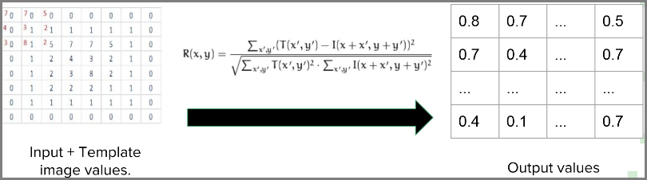
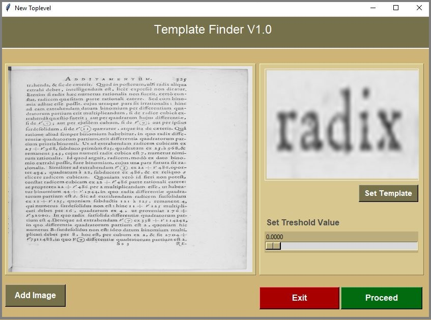
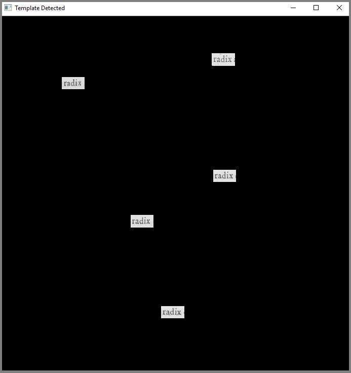

# Detection of Image occurrences using a template mechanism

### Introduction
- The objective is to determine the position of all instances of a given template in an parent image.
- We have used template matching mechanism to identify the template image inside the parent image.
- Template matching
  - A method for searching and finding the location of a template image in a parent image.
  - It simply slides the template image over the input image (as in 2D convolution) and compares the template and patch of input image under the template image.

### Implementation Assumptions
- Given template image is in the same scale of the parent image.
- Otherwise we have to rescale the template image to the same scale of the parent image.

### Implementation Process
- **Step 01** - Reading Images and Templates
- **Step 02** - Converting RGB images to Grayscale
- **Step 03** - Creating a Mask Filter 
- **Step 04** - Template Matching
  - For template matching we have used openCV function matchTemplate() which requires 3 main parameters.
    - Input image
    - Template image
    - Template matching methodology

  - As the algorithm methodology we choosed [*normalized sum of squared differences*](https://opencv-python-tutroals.readthedocs.io/en/latest/py_tutorials/py_imgproc/py_template_matching/py_template_matching.html) 
   
  
  
- **Step 05** - Thresholding
- **Step 06** - Tagging The Occurrences
- **Step 07** - Combining The Mask
- **Step 08** - Display the Output

### ScreenShots  

 

### Used Technologies

- [OpenCV using Python](https://opencv-python-tutroals.readthedocs.io/en/latest/)
- [Tkinter Standard GUI Library](https://docs.python.org/3/library/tk.html)
- [Pillow Library](https://pillow.readthedocs.io/en/stable/)
- [Page UI building Tool](http://page.sourceforge.net/)

 

### Installation Guidance

**PREREQUISITES**

- Python 3.7 or above
- Install Tkinter, Pillow libraries

 

### Developers
<table>
<tr>
<td align="center"></td>
<td align="center"></td>
<td align="center"></td>
<td align="center"></td>
<td align="center"></td>
</tr>
<tr>

<td align="center"><a href="https://github.com/dinuka-kasun-medis">Dinuka Kasun Medis</a></td>
<td align="center"><a href="https://github.com/michellekarunaratne">Michelle Karunarathne</a></td>
<td align="center"><a href="https://github.com/RavinduSachintha">Ravindu Sachintha</a></td>
<td align="center"><a href="https://github.com/pasindumadusanka95">Pasindu Madusanka</a></td>
<td align="center"><a href="https://github.com/Sacheerc">Sachintha Rathnayake</a></td>
</tr>
</table>

 

### Contributing
Warmly welcome to developers for contributing this Project. Make sure to open an issue and communicate with us before 
creating a Pull Request.

 

### License

The PersoAd System is open-sourced software solution licensed under the [GNU General Public License v3.0](./LICENSE).
